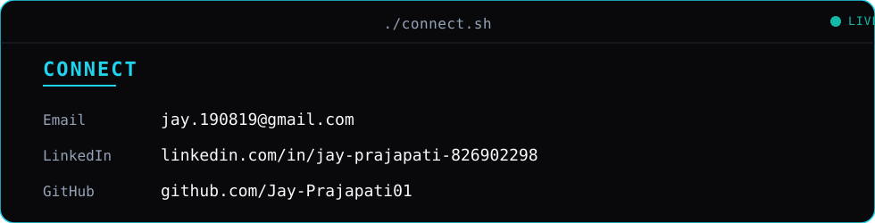

<picture>
  <source media="(prefers-color-scheme: dark)" srcset="https://raw.githubusercontent.com/Jay-Prajapati01/Jay-Prajapati01/output/snake-dark.svg" />
  <source media="(prefers-color-scheme: light)" srcset="https://raw.githubusercontent.com/Jay-Prajapati01/Jay-Prajapati01/output/snake-light.svg" />
  
</picture>

