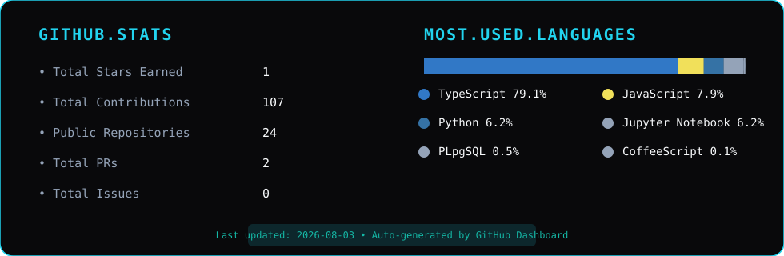
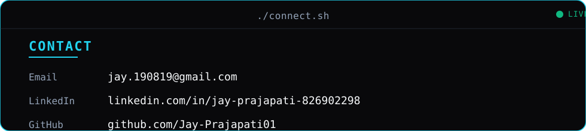

<table width="100%" cellspacing="0" cellpadding="0" border="0">
<tr>
<!-- LEFT PANEL: GIF -->
<td width="38%" valign="top" style="padding:0;margin:0;border:0;">
  
</td>

<!-- RIGHT PANEL: SVG -->
<td width="62%" valign="top" style="padding:0;margin:0;border:0;">
  
</td>
</tr>
</table>

<!-- STREAK STATS -->

  

<!-- UNIFIED DASHBOARD -->

  

<!-- CONTACT TERMINAL -->

  

<!-- SNAKE ANIMATION -->

  <picture>
    <source media="(prefers-color-scheme: dark)" srcset="https://raw.githubusercontent.com/Jay-Prajapati01/Jay-Prajapati01/output/github-snake-dark.svg" />
    <source media="(prefers-color-scheme: light)" srcset="https://raw.githubusercontent.com/Jay-Prajapati01/Jay-Prajapati01/output/github-snake.svg" />
    
  </picture>

<!-- SOCIAL BADGES -->

  
  &nbsp;&nbsp;
  

